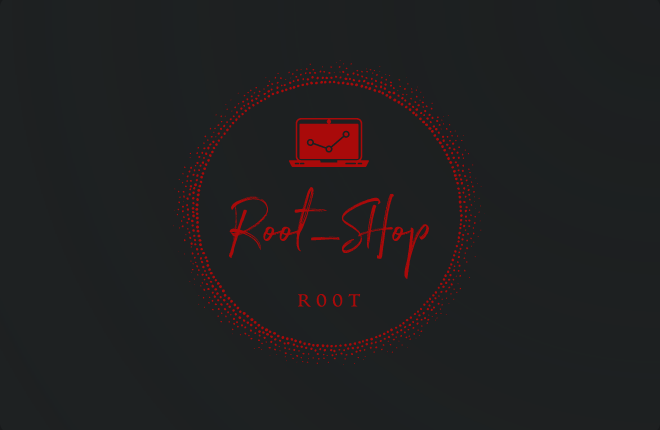

 # *R00T SHOP*

*A small ecommerce website that I've created to enhance my skills for the future!*


<p align="center">
  
</p>


<div style="text-align: center;">
  
  
  
  
  
  
  
</div>


## Table of Contents

- [Introduction](#r00t-shop)
- [Features](#features)
- [Getting Started](#getting-started)
- [Installation](#installation)
- [Usage](#usage)


## Features

1. **Custom Cart Integration** 🛒
   Experience seamless and personalized shopping with our custom-built cart feature. Add, modify, and track your selected products effortlessly. Whether you're shopping for one item or a whole wishlist, our cart has got you covered!

2. **ViewSets for Enhanced Functionality** 🚀
   I've harnessed the power of Django Rest Framework's ViewSets to provide you with dynamic and efficient API endpoints. Our ViewSets offer a streamlined way to interact with the backend, ensuring smooth data retrieval and updates.

3. **User-Friendly API** 🤝
   Embrace the simplicity and ease of use with our API. I've crafted it to be intuitive and developer-friendly, making it a breeze for you to integrate, consume, and extend the functionalities of our E-commerce website. 


## Getting Started

To set up the project locally for development, follow these steps:

1. **Clone the Repository:**
   ````
    git clone https://github.com/r00tk3y/root_shop.git
   ````

2. **Navigate to the Project Directory:**
    ````
    cd root_shop
    ````

## Installation

1. **Create a virtual environment && Activate it:**
     ```
     python -m venv venv 
     source venv/bin/activate
    ```

2. **Install Dependencies**
    ```
    pip install -r requirements.txt
    ```
3.  **Migrate Database**
    ```
    python manage.py makemigrations
    python manage.py migrate
    ```
4. **Create a superuser**
   ```
   python mange.py createsuperuser
   ```

## Usage
1. **Running server**
   ```
   python manage.py runserver
   ```
2. **Fixtures**
   ```
   python manage.py loaddata fixtures/data.json
   superuser -> admin:admin
   ```
3. ***Docker***
   ```
    docker-compose up -d
   ```


## Notes
1. Install dark reader so that the white theme does not hurt your eyes :D
